# Končno poročilo – Analiza podatkov Formule 1

## Opis problema

Cilj projekta je analizirati različne dejavnike, ki vplivajo na uspešnost v Formuli 1. Osredotočamo se na več ključnih vprašanj:

- Kako vremenske razmere vplivajo na čase krogov in rezultate dirk? Ali so nekateri vozniki boljši v slabših vremenskih razmerah?  
- Kako zmogljivost avta vpliva na uvrstitev voznikov (ali se vidi, kateri proizvajalci so boljši).
- Kako uvrstitev na kvalifikacijah vpliva na končni rezultat dirke? Ali obstaja močna korelacija med štartnim položajem in končno uvrstitvijo?
- Ali je za boljši rezultat pomembnejša visoka hitrost na ravninah ali učinkovitost v ovinkih.
- Prikazati, kako obraba različnih trdot pnevmatik vpliva na čase krogov skozi dirko.
- Napoved zmagovalca dirke in svetovnega prvaka glede na pretekle dirke in kvalifikacije trenutne sezone.

---

## Podatki

Podatki so pridobljeni s knjižnico `fastf1`, ki omogoča dostop do uradnih F1 podatkov (časi krogov, telemetrija, vreme, rezultati). Večinoma smo uporabljali le natančne kroge (brez postankov, varnostnih avtomobilov...).

Uporabljeni atributi:

- LapTime, TyreLife
- Driver, Team
- GridPosition, Position
- Compound
- Race, Season
- Weather, Speed, Telemetry

---

## Streamlit aplikacija

[Povezava do streamlit aplikacije za interaktivni prikaz analiz.](https://pr2610-87wgacwuup9jwrtbajsgyt.streamlit.app)

---

## Izvedene analize

### 1. Degradacija pnevmatik

Načrt analize:
- primerjava degradacije in časa kroga različnih trdot gum na eni dirki
- primerjava degradacije različnih trdot gum na vseh dirkah
- statistična analiza degradacije gum po dirkah

Metoda:
- linearna regresija (TyreLife / LapTime)
- izračun naklona (s / krog)
- statistična analiza

Rezultati (za sezono 2026):

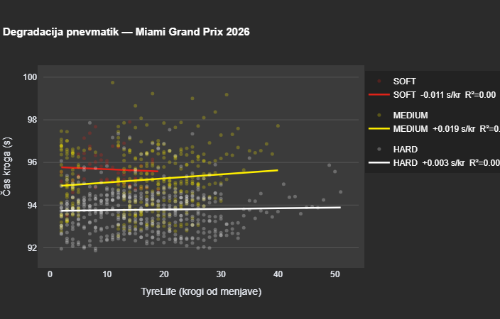

**Najhitrejša in najpočasnejša degradacija po dirki**

| Dirka                 | Mediana časa (s) | Najboljša trdota | Najpočasnejša degradacija | Najslabša trdota | Najhitrejša degradacija |
| --------------------- | ---------------: | ---------------- | ------------------------: | ---------------- | ----------------------: |
| Australian Grand Prix |           84.862 | MEDIUM           |                   -0.1322 | HARD             |                 -0.0143 |
| Canadian Grand Prix   |           77.062 | SOFT             |                   -0.1028 | HARD             |                 -0.0376 |
| Chinese Grand Prix    |           98.121 | HARD             |                   -0.0543 | SOFT             |                  0.2561 |
| Japanese Grand Prix   |           95.263 | HARD             |                   -0.0359 | MEDIUM           |                  0.0071 |
| Miami Grand Prix      |           94.298 | SOFT             |                   -0.0111 | MEDIUM           |                  0.0190 |

- Hitrost degradacije gum je odvisna od proge in vremena, zato imajo nekatere gume manjšo degradacijo na eni progi in večjo na drugi, zato ni ene najboljše trdote.
- Na dirki v Miamiju v sezoni 2026 so imele SOFT gume najboljšo degradacijo (vsak krog je bil hitrejši), ampak HARD gume so bile povprečno 1.5 sekunde hitrejše na krog in so bile kljub slabši degradaciji v kombinaciji z daljšo uporabo na koncu najboljša izbira.

---

### 2. Vpliv vremena

Načrt analize:
- primerjava voznikov v deževnih razmerah glede na:
    - skupen povprečen čas krogov v dežju
    - skupen seštevek točk, ki so jih vozniki dobili v dirkah, kjer je bil prisoten dež
    - analiza vseh deževnih dirk, glede na uporabo pnevmatik in časov krogov

Cilj:
- ugotoviti, kateri vozniki so bili najboljši v deževnih razmerah ter prikaz, kako dež vpliva na čase krogov

Povprečni časi krogov, dirkači so morali odvoziti vsaj 50 krogov v deževnih razmerah, drugače se jih ni vključilo:

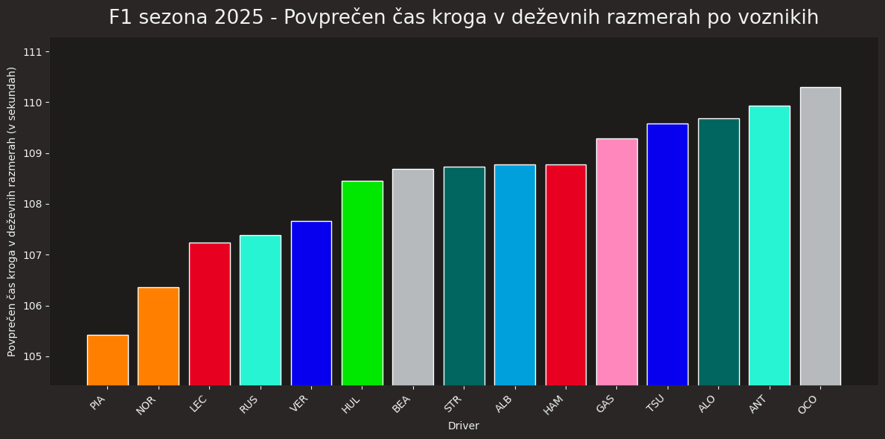

Iz tega grafa razberemo, da sta oba voznika Mclarna dominirala tudi v deževnih razmerah, nekateri vozniki hitrih ekip so bili tudi hitrejši, najhitrejši v "midfield-u" je bil pa Hulkenberg, kar ni presenetljivo, saj je na eni izmed teh dirk končno dobil svoje prve karierne stopničke.

Točke, ki so jih vozniki dobili v deževnih razmerah:

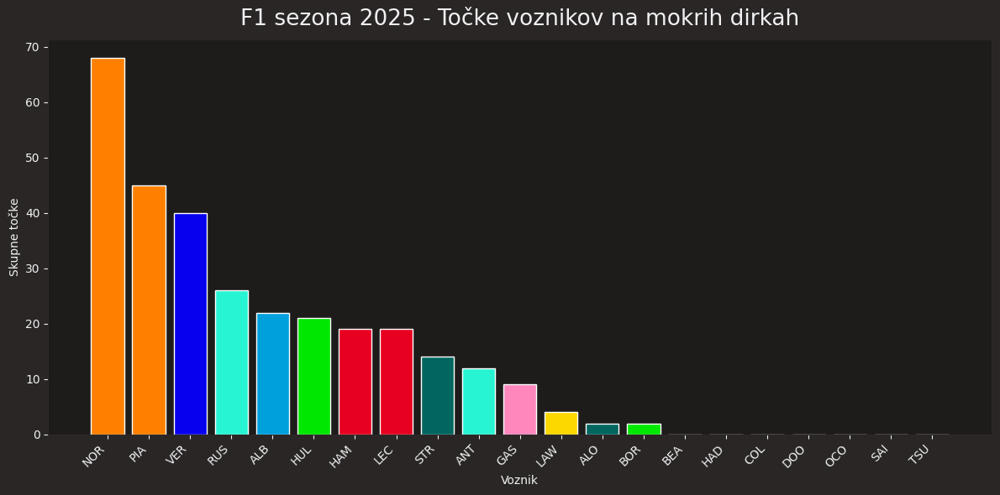

Tudi tukaj je razvidno, da sta oba Mclarna dominirala, vendar tokrat v obratnem vrstnem redu, saj je Piastri v eni izmed teh dirk naredil napako, zaradi česar je izgubil nekaj pozicij, in tudi v eni drugi dirki dobil kazen med dirko, zaradi česar ni dobil zmage.

Še graf VN Avstralije:

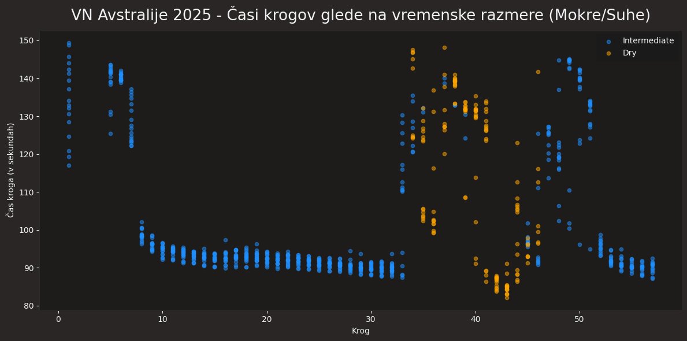

Vidimo, da je bilo na začetku kar počasi, zaradi varsnostnega avta, nato so se časi nekoliko umirili. Okoli 35 kroga pa je razvidno, da so ekipe mislile, da bojo pnevmatike za suhe razmere hitrejše, vendar so po 10-15 krogih šle nazaj na pnevmatike za mokre razmere.

In še graf VN Belgije:

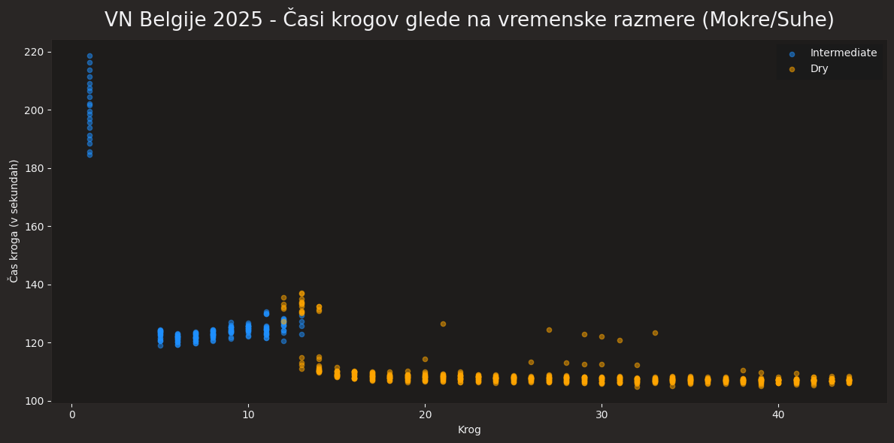

Tukaj pa vidimo manj kaotično dirko glede časov, na začetku so odpeljali nekaj krogov za varnostnim avtom (ker je FIA določila, da je bila proga premokra za dirkanje), nato so par krogov dirkali na pnevmatikah za mokre razmere, okoli 12 kroga pa zamenjali na pnevmatike za suhe razmere.

---

### 3. Vpliv zmogljivosti ekip

Načrt analize:
- primerjava ekip glede na:
    - povprečno odstopanje ekip od najhitrejšega kroga na dirki v sezoni
    - trend zmogljivosti ekip skozi sezono
    - primerjava konstruktorjev po mediani odstopanja od najhitrejšega kroga
    - grupiranje ekip s k-means
    - radar chart

Cilj:
- ugotoviti, katere ekipe (proizvajalci) so najbolj konkurenčne

Rezultat (za sezono 2026):

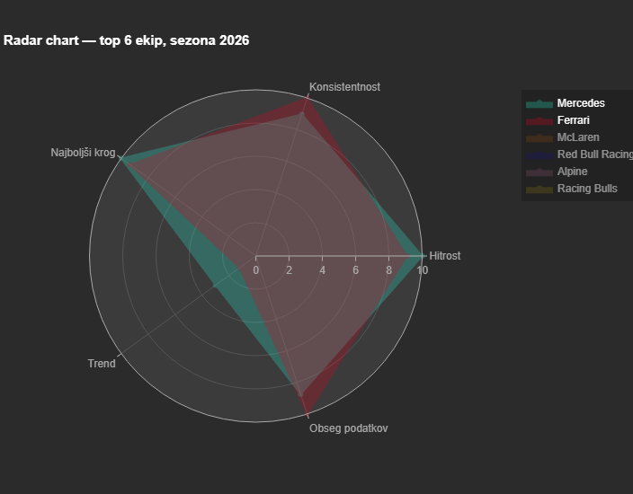

Iz radarskega grafa se vidi, da je ekipa Mercedes boljša kot ekipa Ferrari v hitrosti in ima posledično tudi več najhitrejših krogov, hkrati pa je ekipa Ferrari bolj konsistentna in ima več podatkov zaradi odstopa Georgea Russella na zadnji dirki v Kanadi.

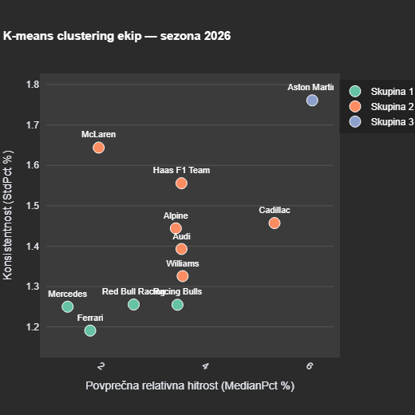

Iz grafa pri delitvi na 3 skupine je razvidno, da so si v letošnji sezoni najbolj konkurenčne ekipe Mercedes, Ferrari in obe ekipi Red Bulla. V 2. skupini so vse ostale ekipe razen ekipe Aston Martin, ki ima v sezoni 2026 največ težav z vozilom.

---

### 4. Kvalifikacije vs. dirka

V tem delu smo preverili, kako močna je korelacija med štartnim položajem in končno uvrstitvijo. Uporabil sem rezultate dirke iz stolpcev `GridPosition` in `Position`. Najprej sem korelacijo izračunal za vse voznike, nato pa še posebej za voznike, pri katerih stolpec `Status` ni pokazal odstopa ali tehničnih težav.

Za primer dirke Italian Grand Prix 2025 je bila Spearmanova korelacija med štartnim položajem in končno uvrstitvijo približno **0.70**, Pearsonova korelacija pa prav tako približno **0.70**. To kaže na pozitivno povezavo: vozniki, ki štartajo bolj spredaj, pogosto tudi končajo dirko višje. Ko sem izločil odstope oziroma nekončane dirke, se je Spearmanova korelacija povečala na **0.79**.

Sezonska analiza za sezono 2025 je pokazala povprečno Spearmanovo korelacijo približno **0.65**. Kvalifikacije so torej zelo pomembne za uspeh, vendar niso edini dejavnik. Na končni rezultat vplivajo še strategija postankov, obraba pnevmatik, varnostni avto, kazni, napake voznikov in zanesljivost dirkalnika.

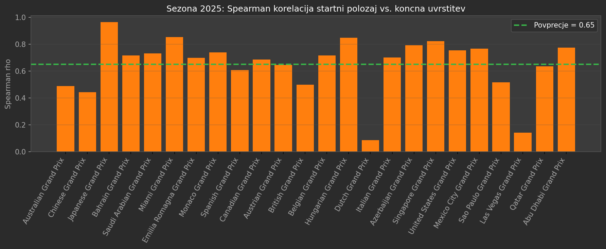

Slika prikazuje Spearmanovo korelacijo med štartnim položajem in končno uvrstitvijo za posamezne dirke v sezoni 2025. Višja vrednost pomeni močnejšo povezavo med dobrimi kvalifikacijami in dobrim končnim rezultatom.

---

### 5. Ravnine vs. ovinki

Ta del analize primerja, ali je z rezultatom bolj povezana hitrost na ravninah ali učinkovitost v ovinkih. Za hitrost na ravninah sem uporabil podatek `SpeedST`, za ovinke pa telemetrijo najhitrejših oziroma reprezentativnih krogov. Pri vsaki dirki sem s pomočjo podatkov o ovinkih na stezi izračunal povprečno hitrost voznika v območju ovinkov.

Na primeru Italian Grand Prix 2025 je bila povezava med hitrostjo na ravninah in končno uvrstitvijo šibka: Spearmanova korelacija je bila približno **0.16**. Pri učinkovitosti v ovinkih je bila povezava močnejša. Spearmanova korelacija je bila približno **-0.52**. Negativna vrednost je pričakovana, ker nižja končna pozicija pomeni boljši rezultat. Višja hitrost v ovinkih je bila povezana z boljšimi uvrstitvami.

Podobno je bilo tudi čez celotno sezono 2025. Učinkovitost v ovinkih je bila pomembnejša za končni rezultat na **20 od 24 dirk**, pri primerjavi z dirkaškim tempom pa na **23 od 24 dirk**. To kaže, da je pomembna celotna učinkovitost dirkalnika, posebej stabilnost in hitrost skozi ovinke.

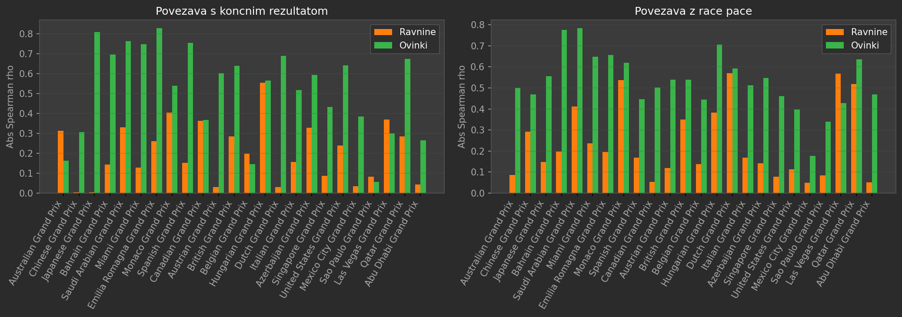

Slika primerja, kako močno sta hitrost na ravninah in učinkovitost v ovinkih povezani s končnim rezultatom oziroma dirkaškim tempom. Večji absolutni Spearmanov koeficient pomeni, da je bila izbrana metrika na tisti dirki močnejši signal uspešnosti.

---

### 6. Napovedovanje rezultatov

Načrt analize:

- Napoved zmagovalca dirke in prvaka sezone na podlagi:
   - kvalifikacijskih rezultatov
   - povprečnih končnih pozicij zadnjih 5 dirk
   - povprečnih štartnih pozicij zadnjih 5 dirk
   - kumulativnih točk v sezoni

- Uporaba RandomForrestRegressor

Cilj:

- Na podlagi znanih rezultatov prvih 5 dirk napovedati zmagovalca vsake naslednje dirke ter določiti najverjetnejšega prvaka sezone

Napovedovalni model je bil treniran na podatkih 2018-2024 (oziroma do 2025 za napovedovanje 2026 sezone)

Ena izmed napovedi za sezono 2025:

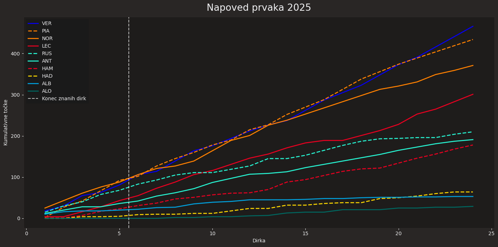

Ter dejanska sezona 2025:

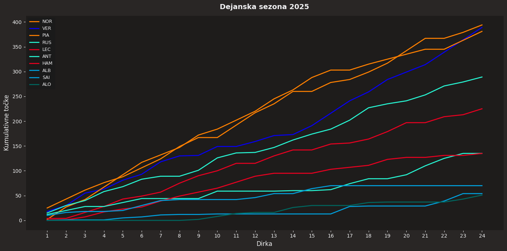

Kakor je razvidno iz grafa, je pravilno dobil top 3 voznike, vendar v napačnem vrstnem redu, v resnici je bil NOR prvak. Tudi voznike od 4-7. mesta je pravilno napovedal, vendar spet v narobnem vrstnem redu.

Ena izmed napovedi za sezono 2026:

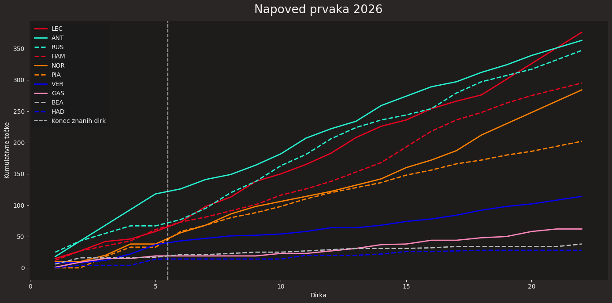

Tukaj pa lahko vidimo, da napoveduje dominanco ekipe Mercedes, vendar ju bo ravno na zadnji dirki voznik Ferrarija prehitel za naslov prvaka. Napoveduje tudi, da bojo skozi sezono top 3 ekipe: Mercedes, Ferrari in Mclaren, Verstappen bo pa tako rekoč "best of the rest".
